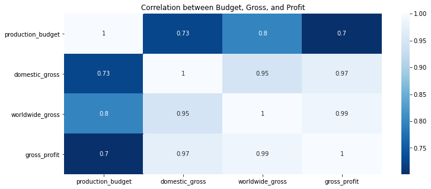

# Analyzing Box Office Trends to Drive Microsoft's Entertainment Strategy
-2-News.jpg)
        Photo by Bruce Nash on [theNumber](https://www.the-numbers.com/news/256960830-Weekend-box-office-Furiosa-top-on-slowest-Memorial-Day-weekend-in-years)

## Overview
Microsoft is on the verge of venturing into the film industry and creation of new movie studio. They tasked me to explore and evaluate the film industry and give them recommendations before making their final decision. My recommendation will be based on types of movies (genres) that are most popular, have most releases, highly rated and have most gross profits to help in reduction close to elimination of losses that they might incur in the process.

## Task
Microsoft has noticed that many large companies are producing original video content and wants to join the trend by establishing a new movie studio. However, they lack experience in movie production. You have been tasked with researching the types of films that are currently performing best at the box office. Your goal is to convert these findings into practical recommendations that can guide the head of Microsoft's new movie studio in deciding what types of films to produce.

## Business Problem
Microsoft's primary challenge is to determine if entering the film industry is a viable business venture. They need to identify the types of films they should create, how to achieve profitability and strategies to distinguish themselves and become market leaders in the industry

## Objectives
* Find Most released, popular genres in the film market
* Find genres with most gross profits that could be of benefit to the company
* Find runtime range taken to watch different genres
* Find link and relationships between avg_rating, vote_count, popularity, budget, gross and profits and how they can help in decision making

## Data Understanding
We have several datasets that we will be dealing with, particularly datasets from: 
* tmdb_movies - https://www.themoviedb.org/  
* the_numbers_movies - https://www.the-numbers.com/  
* imdb_movies - im Database consists of several tables; movie_basics, movie_ratings, etc., but the most important tables we will be utilizing from this Database using SQLite are `movie_basics` and `movie_ratings`  

## Analysis Overview
- Importing Libraries and Loading Data
- Importing Libraries
- Loading Data
- Data Preprocessing and Cleaning
- Merging DataFrames We Will Be working With
- Exploratory Data Analysis Process
- Conclusion
- Recommendation

## Getting Started
From Choosing, Merging, Cleaning and Merging data and also coming up with descriptive statistics, I came up with epitomizes my recommendations that were all brought from the merged data all from different sources

### Top 10 Most Released Genres

Here's a horizontal bar chart displaying the number of films by genre. The genres are listed along the y-axis, and the number of films in each genre is indicated on the x-axis. This visualization clearly shows the distribution of films across top 10 most released different genres, with "Drama" having the highest count of 94 films and "Drama, Romance" having the lowest count of 36 films among the listed categories

### Top 10 Rated Genres

From the above plot, venturing into creating top 5 rated type of films would be ideal and profitable because they seem to be interesting to watch.

### Top 10 Most Popular Genres

The above plot shows the top most popular types of genres that you be selective on to suite your best of interest as a company. Adventure, Fantasy genre is the top most popular and thrilling to watch. That is according to the analysed data

### Top 10 Most Profitable Genres

According to the plot above, Family, Fantasy, Musical is one of the highly profitable genres of all time. Venturing into this type of genre while creating films would be ideal for it will also mean great and high gross return.

### Top Average Runtime 

The above plot show those average minute most of the films take between 129 and 161 minutes. It will be ideal if when venturing into film making, then averagely runtime minutes should be within that range to eliminate boredome. Movies series are always in form of episodes but also on the same, runtime minutes is a factor that is needed to be put into consideration

### Correlation Between avg_rating And popularity

As we can see, correlation between avg_rating and popularity is 0.28376 which is an indication of weak positive correlation. A weak positive correlation between two variables means that as one variable increases, the other variable tends to increase as well, but the relationship is not strong. In other words, there is some positive association between the variables, but it is not consistent or pronounced. Precisely, popularity does not go hand in hand with rating. A genre can be highly rated but less popular

### Correlation Between gross_profit And popularity

The above correlation between gross profit and popularity is 0.28376 indicating weak positive correlation. From the above graph, popularity of genres seems to be increasing but not the gross profit. This is can't be put into consideration, meaning that, it is not a must a type of genre be popular for it to be profitable. 

### Correlation Between Budget, Gross And Profit

From the above heat map, there is strong positive correlation between the gross profit, worldwide gross, domestic gross and production budget. 
A strong positive correlation between the gross profit, worldwide gross, domestic gross, and production budget indicates that as one of these variables increases, the others tend to increase as well. Let's define these variables and explore their interrelationships:  

- Gross Profit: This is the revenue from a film after subtracting the production costs.  
- Worldwide Gross: This is the total revenue a film earns globally.  
- Domestic Gross: This is the revenue a film earns within its home country (usually the USA for Hollywood films).  
- Production Budget: This is the total cost to produce the film.  

This is a factor to be considered more so, when coming up with a production budget, there must be a projection that there is need to ensure probability of having gross profit from the film market are high

### Correlation between vote_count And avg_rating

The above heatmap plot above, there is weak positive correlation between vote count and avg_rating of 0.4. This is an indication that number of vote counts does not determine the rating of genres in the film market

## Conclusion
From different identified genres in the film industry:-  

- Drama is most released type of genre 

- Drama, Mystery, War is the most rated genre 

- Adventure, Fantasy is most popular genre

- Family,Fantasy,Musical is most profitable genre with highest gross profit

- The High average runtime_minute for genres range between 129 to 161 minutes and it's important to having movies within this range. 

- From the provided data obtained from different sources indicates 

  - their is a relationship between rating and popularity of the genres but not pronounced  
  popularity of a movie does not guarantee higher rating and vice versa
  
  - the weak positive correlation between gross profit and popularity is also not pronounced  
  popularity of a created film won't guarantee profitability but exploring diversity on marketing strategy will help.
  
  - there is strong positive correlation between production budget and gross profit  
  This correlation indicates that for one to get more profit, it depends on how much the company willing to put in the     production of movie
  
  - there is weak positive correlation between number of votes given and rating of genres
  It is important to also note that having having higher number of votes does not guarantee higher rating.
## Recommendation
When creating films, the company should consider several key factors to ensure success and profitability

- Market Trends and Audience Preferences
- Budget and Financial Planning
- Talent and Creative Team that will help in the success and profitability of the studio
- Marketing Strategy 
- Innovativity
- maximum Runtime minutes for every movie to range between 129 - 160 minutes
